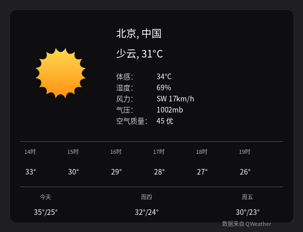

# QWeather Weather Desklet (和风天气)

A Cinnamon desklet that displays weather from the [QWeather (和风天气)](https://www.qweather.com)
API. Built with Chinese users in mind, it offers excellent support for locations
in China, Chinese weather texts, air quality (AQI), and official severe weather
warnings issued by Chinese meteorological authorities.

## Features

* Current conditions with a large weather icon
* Hourly forecast strip for the next few hours
* Daily forecast for up to 10 days (depending on your subscription)
* Real-time air quality index (AQI), coloured by pollution level
* Severe weather warning banners (台风、暴雨、高温……预警) with the full
  warning text in a tooltip
* City search through the QWeather GeoAPI — works with Chinese city names
  (`上海`), pinyin, English names, Location IDs and coordinates
* Weather texts in 18 languages, automatically following your system locale
* Multiple icon styles, including the official QWeather icons
* Celsius/Fahrenheit, metric/imperial units, optional Beaufort wind force
  display (`3级` style)
* Fully translatable (simplified Chinese translation included)

## Requirements

* Cinnamon 5.4 or later (Linux Mint 21+ or equivalent)
* A free [QWeather developer account](https://dev.qweather.com/) with an
  API key. The free subscription (50,000 requests/month) is sufficient.

## Configuration

After adding the desklet, open its settings and provide:

1. **API key** — create a project with *Web API* credentials at
   [dev.qweather.com](https://dev.qweather.com/), then copy the key into the
   desklet settings.
2. **API Host** — *recommended*. QWeather assigns every account a dedicated
   API Host (e.g. `abc123xyz.def.qweatherapi.com`). You find it in the
   [console](https://console.qweather.com/) under *设置*. City name search
   **requires** the dedicated host; the public host `api.qweather.com` is being
   phased out and only serves some endpoints.
3. **Location** — one of:
   * a city name, in Chinese or any supported language: `北京`, `Shanghai`,
     `哈尔滨`
   * a QWeather Location ID: `101010100`
   * coordinates as `longitude,latitude`: `116.41,39.92` (the order is
     auto-detected for unambiguous cases)

   The desklet resolves names to coordinates with the QWeather GeoAPI and
   shows the city name returned by the service. You can override the
   displayed name in the settings.

### Display options

The settings dialog lets you toggle individual data rows (humidity, pressure,
visibility, precipitation, UV index, sunrise/sunset, AQI), the hourly forecast
strip, warning banners, and per-day forecast rows. See the tooltips in the
settings dialog for details.

## Icons

* `icons/qweather/` — [QWeather Icons](https://icons.qweather.com/),
  © QWeather, licensed under
  [CC BY 4.0](https://creativecommons.org/licenses/by/4.0/). Icon file names
  match the QWeather icon codes. They are rendered in white.
* `icons/light/`, `icons/dark/`, `icons/colourful/`, `icons/flat_black/`,
  `icons/flat_white/`, `icons/flat_colourful/` — icon sets from the
  [bbcwx](https://cinnamon-spices.linuxmint.com/desklets/view/20) desklet
  (© Merlin the Red, VClouds, digitalchet and others, see their README files),
  mapped from QWeather icon codes.
* `icons/user/` — drop your own icons here to use the *User defined* icon
  style, see `icons/user/README`.

## Acknowledgements

This desklet is based on **bbcwx** by Chris Hastie (which was itself forked
from *accudesk* by loganj). Much of the layout, styling and settings code
comes from bbcwx, licensed under GPLv3.

Weather data © [QWeather](https://www.qweather.com/). The API responses
include attribution requirements; please keep the "Data from QWeather" credit
link enabled.

## License

GPLv3. See [COPYING](../COPYING) in the repository root.
